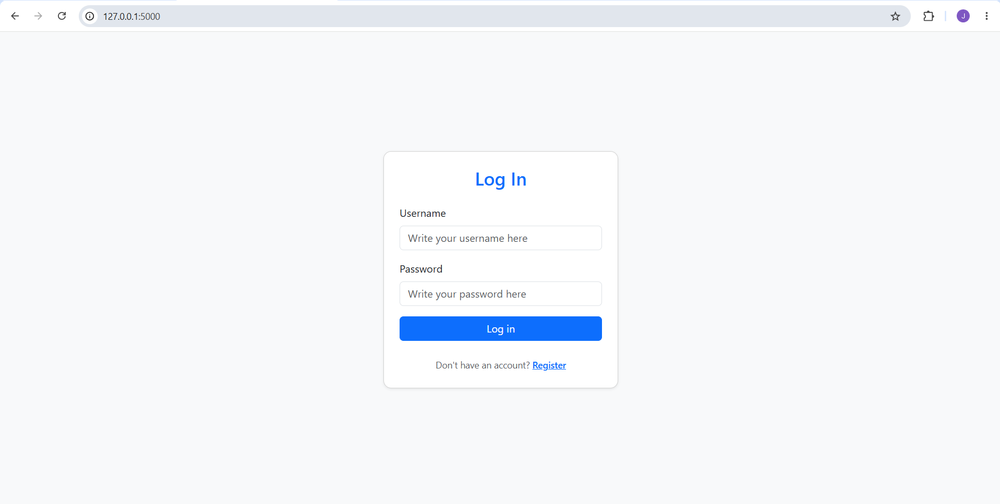
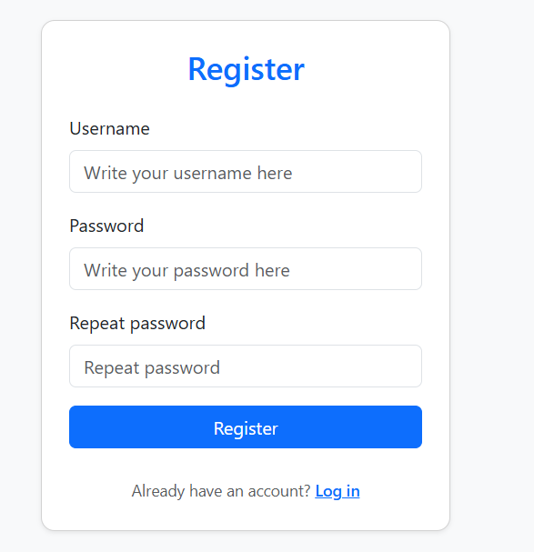
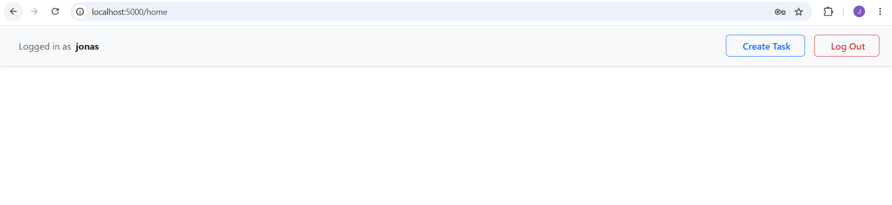
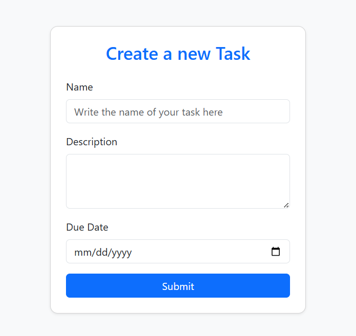

# TaskFlow

A Flask-based Task Flow application with user authentication using JWT stored in cookies, SQLAlchemy for persistence, and basic CRUD functionality for tasks.


## Features

User registration and login

JWT authentication using Flask-JWT-Extended

JWT stored securely in HTTP cookies

User-specific task lists

Create, update, and delete task

SQLite database using SQLAlchemy ORM

Server-side rendered templates (Jinja2)

## Creating a user
Before accessing the task application, all users must log in.
If you don't have a user, you can just click register.

<p align="center">
  
  
</p>

After logging in, you will be met with a blank page containing only a header.

<p align="center">
  
</p>

---

## Accessing the tasks

If you click the button "Create task" you will get to the task creation page, which will pop up in your homepage until you delete them.

<p align="center">
  
  
</p>

## Tech Stack

Python 

Flask

Flask-SQLAlchemy

Flask-JWT-Extended

SQLite

Jinja2 templates

Docker 

## Running with Docker

### Clone the repository:

```bash
git clone https://github.com/jonasolivernicolaysen/TaskFlow.git
cd TaskFlow
```
### Build and start the application
```bash
docker compose up --build
```

Open your browser and navigate to http://localhost:5000


